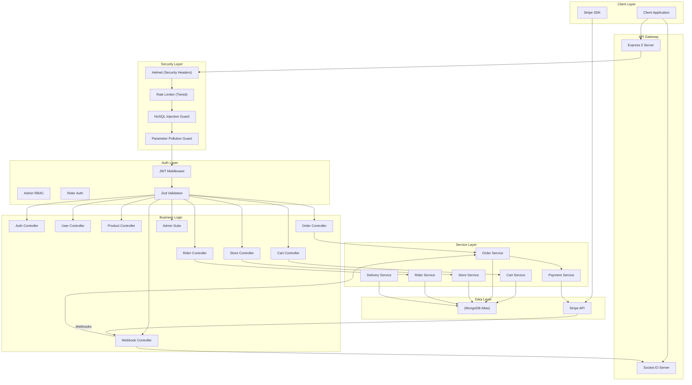

# System Architecture

## High-Level Overview

FlashCart is designed as a modular monolithic API, optimized for high performance and strict data consistency. The architecture leverages Express 5 for its streamlined middleware handling and MongoDB for native geospatial support and multi-document transactions.



---

## Request Lifecycle

1.  **Edge Security:** CORS validation and Helmet header enforcement.
2.  **Traffic Control:** Global rate limiting (100 req/15 min) to prevent abuse.
3.  **Payload Processing:** JSON body parsing and NoSQL injection sanitization.
4.  **Validation:** Route-specific Zod schema enforcement.
5.  **Authentication:** JWT verification with session rotation logic.
6.  **Orchestration:** Controller layer extracts input and delegatest to specialized Services.
7.  **Business Logic:** Service layer executes DB transactions and external# API Reference

> **Base URL:** `http://localhost:5000/api/v1`
>
> All endpoints return a standardized JSON response: `{ statusCode, data, message, success }`

---

## Authentication Patterns

FlashCart supports two primary authentication methods:

- **Cookie-based:** `accessToken` (httpOnly), automatically handled by modern browsers.
- **Header-based:** `Authorization: Bearer <jwt>`, for mobile or third-party clients.
. This mirrors the real-world constraint where each order is fulfilled by a specific warehouse. Switching stores triggers a cart reset to avoid cross-store fulfillment complexity.

### 2. Snapshot-Based Orders
To ensure historical accuracy, orders store copies of item details (names, prices, images) and the delivery address as they existed at checkout. This prevents historical orders from being affected by future product or profile changes.

### 3. Post-Payment Stock Deduction
To ensure historical accuracy, orders store copies of item details (names, prices, images) and the delivery address as they existed at checkout. This prevents historical orders from being affected by future product or profile changes.

### 3. Post-Payment Stock Deduction
Inventory is deducted from `StoreInventory` only after Stripe confirms payment. This avoids "locked" stock from abandoned carts. Atomic `findOneAndUpdate` operations with `$gte` guards prevent overselling during high-concurrency periods.

### 4. Session-Based Multi-Device Login
The `User` model tracks an array of active `sessions`. Each session is bound to a specific device and IP, allowing for precise session revocation and multi-device support without shared token vulnerabilities.

### 5. Isolated Rider Authentication
Riders utilize a dedicated authentication flow and separate JWT middleware. This segregation ensures that rider privileges never overlap with user or admin roles, simplifying security audits.

### 6. Tiered Delivery Economics
Delivery fees are calculated dynamically based on distance:
- **Local (0-2 km):** ₹20 flat
- **Standard (2-5 km):** ₹20 + ₹10/km
- **Extended (5-10 km):** ₹50 + ₹15/km
- **Long-Range (10+ km):** ₹125 + ₹20/km

### 7. Idempotent Webhooks
The payment confirmation service includes status-checks to ensure that duplicate Stripe webhooks do not trigger multiple fulfillment workflows.

---

## Database Indexing Strategy

| Collection         | Index                                        | Purpose                          |
| ------------------ | -------------------------------------------- | -------------------------------- |
| `users`            | `{ contactNumber: 1 }` (unique)              | Login lookup                     |
| `users`            | `{ isDeleted: 1 }`                           | Soft-delete filtering            |
| `products`         | `{ name: "text", description: "text" }`      | Full-text search                 |
| `products`         | `{ category: 1, isAvailable: 1 }`            | Category browsing                |
| `products`         | `{ currentPrice: 1 }`                        | Price sorting                    |
| `darkstores`       | `{ location: "2dsphere" }`                   | Geospatial nearest-store queries |
| `darkstores`       | `{ isActive: 1, location: "2dsphere" }`      | Active store geo-queries         |
| `storeinventories` | `{ storeId: 1, productId: 1 }` (unique)      | Prevent duplicate mappings       |
| `orders`           | `{ user: 1, createdAt: -1 }`                 | User order history               |
| `orders`           | `{ status: 1 }`                              | Admin order filtering            |
| `orders`           | `{ "deliveryAddress.location": "2dsphere" }` | Location-based queries           |
| `orders`           | `{ assignedRider: 1, status: 1 }`            | Rider's active order lookup      |
| `riders`           | `{ phone: 1 }` (partial unique: isActive)    | Login + soft-delete reuse        |
| `riders`           | `{ status: 1, isActive: 1 }`                 | Available rider search           |
| `carts`            | `{ user: 1 }` (unique)                       | One cart per user                |
| `carts`            | `{ user: 1, storeId: 1 }`                    | User + store lookup              |

---

## Transaction Boundaries

Two operations use MongoDB ACID transactions (require replica set):

### 1. Order Creation (`createOrderFromCart`)

```
START TRANSACTION
  ├── Validate cart (price + stock consistency)
  ├── Fetch user addresses
  ├── Calculate distance (geoNear)
  ├── Calculate delivery fee and total
  ├── Save order (with embedded snapshots)
  └── Clear cart
COMMIT
```

### 2. Payment Confirmation (`confirmOrderPayment`)

```
START TRANSACTION
  ├── Fetch order (with session lock)
  ├── Idempotency check (skip if not PENDING_PAYMENT)
  ├── For each item:
  │     └── Atomic stock deduction (findOneAndUpdate with $gte guard)
  ├── Find available rider
  ├── Assign rider (if available)
  ├── Calculate ETA
  └── Update order status + save
COMMIT
```
