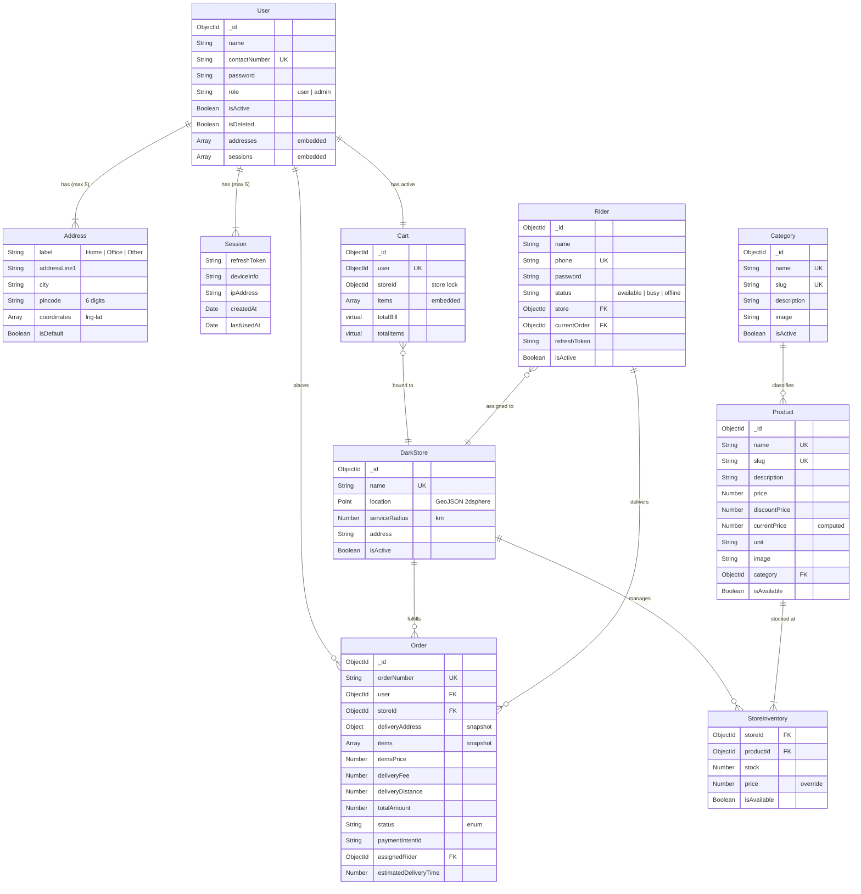

```mermaid
erDiagram
    User ||--o{ Order : places
    User {
        ObjectId _id
        String name
        String contactNumber UK
        String password
        String role "user | admin"
        Boolean isActive
        Boolean isDeleted
        Array addresses "embedded"
        Array sessions "embedded"
    }

    %% Embedded sub-documents (shown for clarity)
    User ||--|{ Address : "has (max 5)"
    Address {
        String label "Home | Office | Other"
        String addressLine1
        String city
        String pincode "6 digits"
        Array coordinates "lng-lat"
        Boolean isDefault
    }

    User ||--|{ Session : "has (max 5)"
    Session {
        String refreshToken
        String deviceInfo
        String ipAddress
        Date createdAt
        Date lastUsedAt
    }

    %% Single active cart per user
    User ||--|| Cart : "has active"
    Cart {
        ObjectId _id
        ObjectId user UK
        ObjectId storeId "store lock"
        Array items "embedded"
        virtual totalBill
        virtual totalItems
    }

    Cart }o--|| DarkStore : "bound to"

    DarkStore ||--o{ Order : fulfills
    DarkStore ||--o{ StoreInventory : manages
    DarkStore {
        ObjectId _id
        String name UK
        Point location "GeoJSON 2dsphere"
        Number serviceRadius "km"
        String address
        Boolean isActive
    }

    Product ||--|{ StoreInventory : "stocked at"
    Product {
        ObjectId _id
        String name UK
        String slug UK
        String description
        Number price
        Number discountPrice
        Number currentPrice "computed"
        String unit
        String image
        ObjectId category FK
        Boolean isAvailable
    }

    Category ||--o{ Product : classifies
    Category {
        ObjectId _id
        String name UK
        String slug UK
        String description
        String image
        Boolean isActive
    }

    StoreInventory {
        ObjectId storeId FK
        ObjectId productId FK
        Number stock
        Number price "override"
        Boolean isAvailable
    }

    %% Order contains embedded snapshots
    Order {
        ObjectId _id
        String orderNumber UK
        ObjectId user FK
        ObjectId storeId FK
        Object deliveryAddress "snapshot"
        Array items "snapshot"
        Number itemsPrice
        Number deliveryFee
        Number deliveryDistance
        Number totalAmount
        String status "enum"
        String paymentIntentId
        ObjectId assignedRider FK
        Number estimatedDeliveryTime
    }

    Rider ||--o{ Order : delivers
    Rider {
        ObjectId _id
        String name
        String phone UK
        String password
        String status "available | busy | offline"
        ObjectId store FK
        ObjectId currentOrder FK
        String refreshToken
        Boolean isActive
    }

    Rider }o--|| DarkStore : "assigned to"
```
