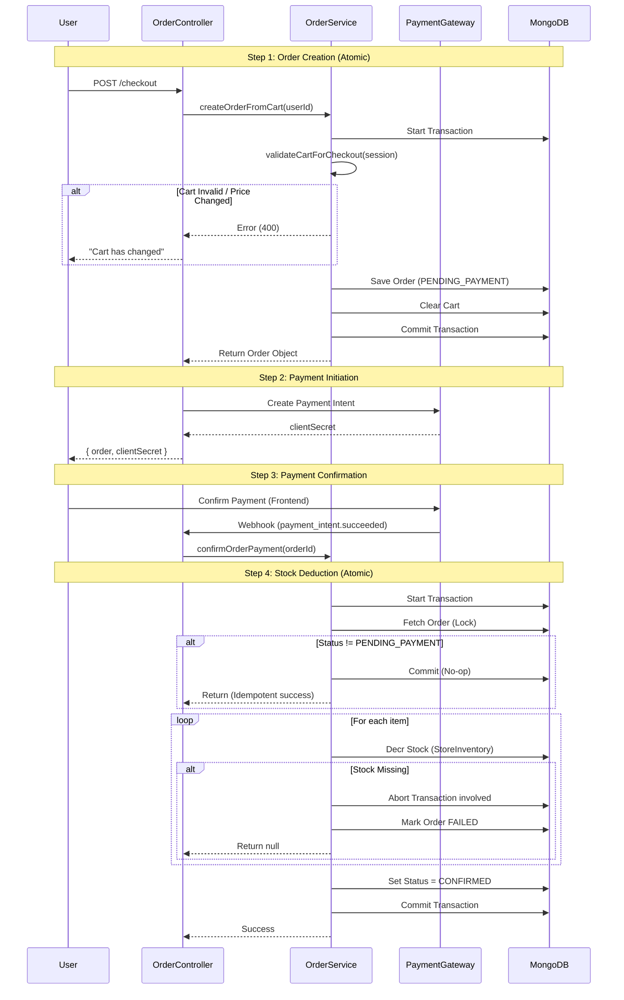

```mermaid
sequenceDiagram
    participant U as User
    participant C as OrderController
    participant S as OrderService
    participant P as PaymentGateway
    participant DB as MongoDB

    Note over U, DB: Step 1: Order Creation (Atomic)
    U->>C: POST /checkout
    C->>S: createOrderFromCart(userId)
    S->>DB: Start Transaction
    S->>S: validateCartForCheckout(session)
    alt Cart Invalid / Price Changed
        S-->>C: Error (400)
        C-->>U: "Cart has changed"
    end
    S->>DB: Save Order (PENDING_PAYMENT)
    S->>DB: Clear Cart
    S->>DB: Commit Transaction
    S-->>C: Return Order Object

    Note over U, DB: Step 2: Payment Initiation
    C->>P: Create Payment Intent
    P-->>C: clientSecret
    C-->>U: { order, clientSecret }

    Note over U, DB: Step 3: Payment Confirmation
    U->>P: Confirm Payment (Frontend)
    P->>C: Webhook (payment_intent.succeeded)
    C->>S: confirmOrderPayment(orderId)

    Note over U, DB: Step 4: Stock Deduction (Atomic)
    S->>DB: Start Transaction
    S->>DB: Fetch Order (Lock)
    
    alt Status != PENDING_PAYMENT
        S->>DB: Commit (No-op)
        S-->>C: Return (Idempotent success)
    end

    loop For each item
        S->>DB: Decr Stock (StoreInventory)
        alt Stock Missing
            S->>DB: Abort Transaction involved
            S->>DB: Mark Order FAILED
            S-->>C: Return null
        end
    end

    S->>DB: Set Status = CONFIRMED
    S->>DB: Commit Transaction
    S-->>C: Success
```
